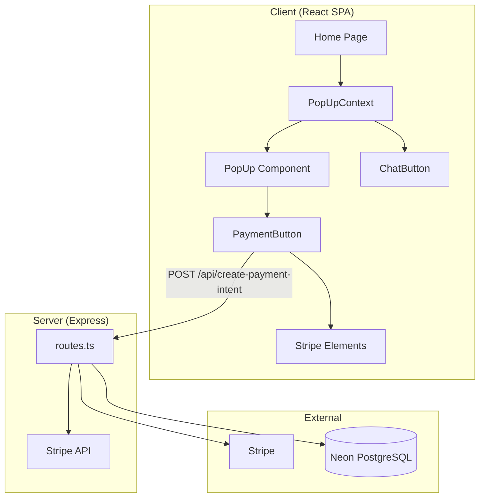
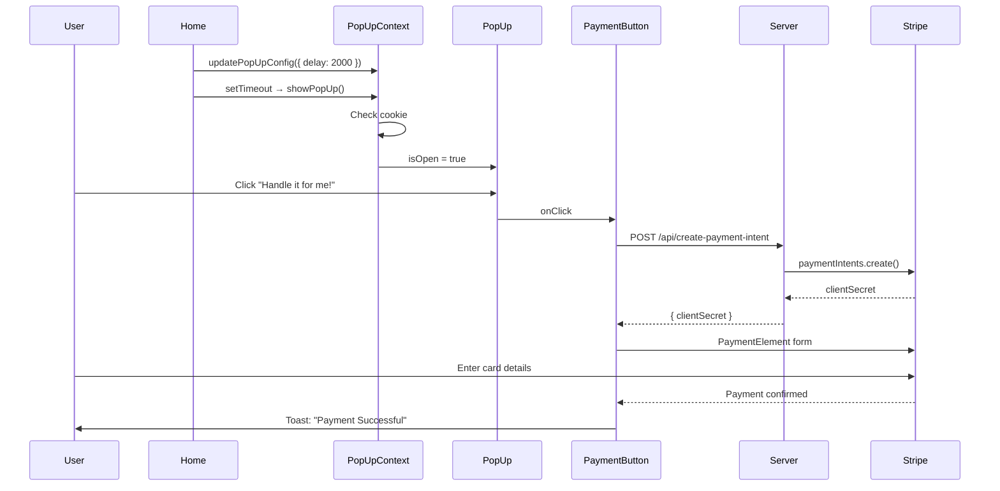

# Architecture — DelayedPopup

## Overview

DelayedPopup is a full-stack TypeScript application that implements an Intercom-style popup widget with Stripe payment integration. The architecture follows a monorepo pattern with shared types, a React SPA client, an Express API server, and a standalone widget package for external integration.

## System Diagram



## Core Components

### PopUpContext (`contexts/PopUpContext.tsx`)

Central state manager for the popup system. Manages:
- **Visibility state** — `isOpen`, `showPopUp()`, `hidePopUp()`
- **Content** — title, description, price, discount, image
- **Configuration** — delay, cookie name, cookie duration
- **Cookie logic** — checks/sets cookies to control display frequency

### PopUp (`components/PopUp.tsx`)

The main UI component. Designed to look like an Intercom chat widget:
- Header with avatar ("Georgie"), online status indicator
- Product image, title, description
- Price with optional crossed-out discount
- PaymentButton for Stripe checkout
- Fake message input bar (triggers payment on click)
- Click-outside and Escape key to close
- Scroll lock when open

### ChatButton (`components/ChatButton.tsx`)

Floating purple bubble (bottom-right corner):
- Bounces every 5 seconds to attract attention
- Hover state changes the smiley icon
- Clears cookie and shows popup on click

### PaymentButton (`components/PaymentButton.tsx`)

Stripe integration component:
1. Click → `POST /api/create-payment-intent` with amount
2. Receives `clientSecret` from server
3. Opens dialog with Stripe `PaymentElement`
4. Handles success/error with toast notifications
5. Mock mode: shows "Simulate payment" button instead

## Data Flow



## Server Architecture

Minimal Express server with a single API route:

| Endpoint | Method | Purpose |
|----------|--------|---------|
| `/api/create-payment-intent` | POST | Creates Stripe PaymentIntent |

The server supports two modes:
- **Real mode** — requires `STRIPE_SECRET_KEY` env variable
- **Mock mode** — `STRIPE_MOCK=true` returns fake `clientSecret`

### Database Schema (`shared/schema.ts`)

| Table | Purpose |
|-------|---------|
| `users` | Basic auth (username, password) |
| `popup_configurations` | Popup content settings (title, description, price, discount, image, active flag) |

## Widget Package

The `popup-widget-package/` directory is a self-contained export of the popup functionality designed for integration into external React apps:

```
popup-widget-package/
├── src/
│   ├── components/     # PopUp, ChatButton, PaymentButton
│   ├── contexts/       # PopUpContext
│   ├── hooks/          # use-toast
│   ├── lib/            # utils, cookie
│   └── styles/         # widget.css
├── README.md           # Full integration guide
├── INTEGRATION_GUIDE.md
└── FILES_TO_COPY.md
```

### Integration Methods
1. **File copy** — copy `src/` into target project
2. **Local npm** — `npm install /path/to/popup-widget-package`
3. **Tarball** — `popup-stripe-package.tgz` in project root

## Technology Decisions

| Decision | Rationale |
|----------|-----------|
| **Intercom-style UI** | Familiar chat pattern increases user trust and engagement |
| **Cookie-based frequency** | Prevents popup fatigue without requiring auth |
| **Stripe PaymentIntents** | Supports 3D Secure, Apple Pay, Google Pay automatically |
| **shadcn/ui + Radix** | Accessible, unstyled primitives with Tailwind theming |
| **Context API** | Simple state management sufficient for single-widget scope |
| **Mock mode** | Development without Stripe account, easy demo deployment |
